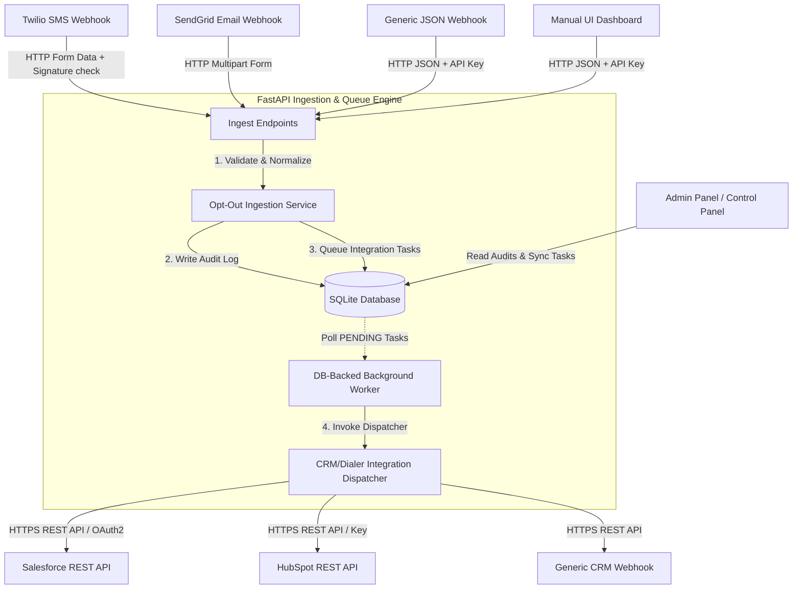

<<<<<<< HEAD
# Multi-Channel TCPA/FCC Opt-Out Integration Layer

A secure, production-grade REST API webhook listener and state-tracked queue engine built in Python (FastAPI) to handle multi-channel TCPA/FCC compliance opt-outs (SMS, Email, Webhooks) and guarantee delivery to downstream CRMs and dialers (HubSpot, Salesforce, and custom targets).

---

## 📖 Table of Contents
1. [System Overview & Architecture](#-system-overview--architecture)
2. [Key Features](#-key-features)
3. [Database Schema & Architecture](#-database-schema--architecture)
4. [Ingestion API Specifications](#-ingestion-api-specifications)
5. [Administration & Audit APIs](#-administration--audit-apis)
6. [Interactive Control Panel (Dashboard)](#-interactive-control-panel-dashboard)
7. [Installation & Setup Guides](#-installation--setup-guides)
8. [Testing & Verification](#-testing--verification)

---

## 🏗️ System Overview & Architecture

This application manages opt-out indicators across Twilio SMS webhooks, SendGrid Email parsing, and generic JSON payloads. It utilizes a **database-backed transactional queue** to ensure that once an opt-out is received, it is stored permanently in SQLite and synchronized to CRMs (like Salesforce and HubSpot) with robust error-tracking and exponential backoff retries.



---

## 🌟 Key Features

*   **Multi-Channel Normalization**: Standardizes inbound SMS data (e.g. `STOP`, `UNSUBSCRIBE`) and phone numbers to international standard E.164 formats automatically. Standardizes emails to lowercased trimmed strings.
*   **Twilio Webhook Verification**: Cryptographically validates webhook signatures (`X-Twilio-Signature`) using your Twilio auth token to prevent request spoofing.
*   **State-Tracked Transactional Queue**: Background worker polling loop tracks tasks with five distinct states (`PENDING`, `PROCESSING`, `COMPLETED`, `FAILED`, `MAX_RETRIES_EXCEEDED`) and logs all errors for audit transparency.
*   **Built-in Interactive Control Panel**: Beautiful glassmorphic dashboard served directly on `GET /` providing real-time data visual charts, system sync rates, active integrations toggling, audit logging lists, and manual opt-out dispatchers.
*   **Zero External Heavy Dependencies**: Runs directly on SQLite and FastAPI's native async lifespan threads without requiring Redis, Celery, or RabbitMQ for simple, cost-effective deployments.

---

## 🗄️ Database Schema & Architecture

SQLite persistent logs are handled via **SQLAlchemy Async ORM** across three main tables:

### 1. `optouts`
Holds the record of normalized inbound opt-outs.
*   `id` (Integer, Primary Key)
*   `identifier` (String, E.164 phone number or email, Indexed)
*   `channel` (String: `sms`, `email`, `web`, `api`)
*   `raw_payload` (JSON, contains the complete original webhook dump)
*   `reason` (String, optional: e.g. `STOP`, `QUIT`, `CANCEL`)
*   `ip_address` (String, optional)
*   `created_at` (DateTime, UTC)

### 2. `integrations`
Defines outbound sync targets and credentials.
*   `id` (Integer, Primary Key)
*   `name` (String, Unique)
*   `type` (String: `hubspot`, `salesforce`, `generic_webhook`)
*   `is_active` (Boolean)
*   `credentials` (JSON: tokens, URLs, headers)
*   `created_at` (DateTime, UTC)

### 3. `sync_tasks`
Tracks task sync states, error history, and retry timelines.
*   `id` (Integer, Primary Key)
*   `opt_out_id` (Integer, Foreign Key to `optouts`)
*   `integration_id` (Integer, Foreign Key to `integrations`)
*   `status` (String: `PENDING`, `PROCESSING`, `COMPLETED`, `FAILED`, `MAX_RETRIES_EXCEEDED`)
*   `retry_count` (Integer, default 0)
*   `max_retries` (Integer, default 5)
*   `last_error` (Text, contains error trace from failed HTTP syncs)
*   `next_retry_at` (DateTime, UTC)
*   `created_at` (DateTime, UTC)
*   `updated_at` (DateTime, UTC)

---

## 🔌 Ingestion API Specifications

### 1. Twilio SMS Ingestion Webhook
Receives standard incoming text messages from Twilio.
*   **URL**: `POST /api/v1/ingest/twilio`
*   **Content-Type**: `application/x-www-form-urlencoded`
*   **Security Header**: `X-Twilio-Signature` (signature verification calculated from requested URL + body + Twilio Auth Token).
*   **Payload Example**:
    ```form
    From=+15558675309
    Body=STOP
    SmsStatus=received
    ```
*   **Response**: `202 Accepted` / `{"status": "queued", "id": 12}`

### 2. SendGrid Inbound Email Parsing
Receives standard emails forwarded by SendGrid Parse.
*   **URL**: `POST /api/v1/ingest/sendgrid`
*   **Content-Type**: `multipart/form-data`
*   **Payload Example**:
    ```form
    from="John Doe <john@example.com>"
    subject="Please unsubscribe me"
    text="Please stop sending emails to john@example.com"
    ```
*   **Response**: `202 Accepted` / `{"status": "queued", "id": 13}`

### 3. Generic JSON Webhook
Accepts programmatic JSON opt-outs from other custom systems.
*   **URL**: `POST /api/v1/ingest/generic`
*   **Content-Type**: `application/json`
*   **Security Header**: `X-API-Key: <ADMIN_API_KEY>`
*   **Payload Example**:
    ```json
    {
      "identifier": "+15550199",
      "channel": "api",
      "reason": "CANCEL",
      "ip_address": "192.168.1.50"
    }
    ```
*   **Response**: `202 Accepted` / `{"status": "queued", "id": 14}`

---

## 🔑 Administration & Audit APIs

All admin routes require authorization using the `X-API-Key` header matching your configured `ADMIN_API_KEY`.

### 1. Manual Opt-Out Creation
*   **URL**: `POST /api/v1/optouts/manual`
*   **Headers**: `X-API-Key: <ADMIN_API_KEY>`
*   **Request Body**: Same as Generic JSON Ingestion.
*   **Response**: `201 Created`

### 2. List & Query Opt-Out Audits
*   **URL**: `GET /api/v1/optouts/`
*   **Headers**: `X-API-Key: <ADMIN_API_KEY>`
*   **Query Parameters**:
    *   `q` (search query for email or phone)
    *   `channel` (filter: sms, email, web, api)
    *   `skip` (pagination)
    *   `limit` (pagination)
*   **Response**: List of audited opt-out objects.

### 3. Retrieve Sync Tasks Logs
*   **URL**: `GET /api/v1/optouts/tasks`
*   **Headers**: `X-API-Key: <ADMIN_API_KEY>`
*   **Query Parameters**:
    *   `status` (PENDING, PROCESSING, COMPLETED, FAILED, MAX_RETRIES_EXCEEDED)
*   **Response**: Detailed logs containing execution timelines, backoffs, and stringified error traces.

---

## 📊 Interactive Control Panel (Dashboard)

Served directly at `GET /` on your deployment host. The dashboard operates on top of standard API queries (reading stats and triggering manual entries) using native security settings.

*   **System Indicators**: Real-time progress bars for completion rates.
*   **Integrations Registry**: Live status toggles to enable or temporarily pause downstream dispatches.
*   **Audit Logger Listing**: Searchable registry showing the most recent opt-outs and raw payloads.
*   **Admin Tools**: Forms to submit manual compliance requests instantly.

---

## 🚀 Installation & Setup Guides

### Method A: Setup with Docker (Recommended)

1.  **Clone the directory** to your local workspace.
2.  **Create your local `.env`** configuration file:
    ```bash
    cp .env.example .env
    ```
    *Open `.env` and fill in your actual settings (Twilio tokens, Hubspot access token, custom Admin key).*
3.  **Build and boot** using Docker Compose:
    ```bash
    docker compose up -d --build
    ```
4.  The server starts at `http://localhost:8000`. You can visit:
    - **Dashboard**: `http://localhost:8000/`
    - **OpenAPI Swagger**: `http://localhost:8000/docs`

### Method B: Manual Python Setup

1.  **Create and activate a virtual environment**:
    ```bash
    python -m venv .venv
    # Windows:
    .venv\Scripts\activate
    # macOS/Linux:
    source .venv/bin/activate
    ```
2.  **Install dependencies** in editable mode:
    ```bash
    pip install -e .
    ```
3.  **Create your local configuration**:
    ```bash
    cp .env.example .env
    ```
4.  **Boot the application ASGI server**:
    ```bash
    uvicorn app.main:app --reload
    ```

---

## 🧪 Testing & Verification

The suite includes integration tests covering signature validation, Pydantic schemas, and background task retry backoffs.

Run the test suite via:
```bash
# Ensure virtual environment is active
pytest
```
*Output yields 7 passed tests with 100% database lock isolation verification.*
=======
# tcpa-optout-integration
tcpa-optout-integration
>>>>>>> 44dcb2a80b029e5448c98626407a2aa3b1087806
